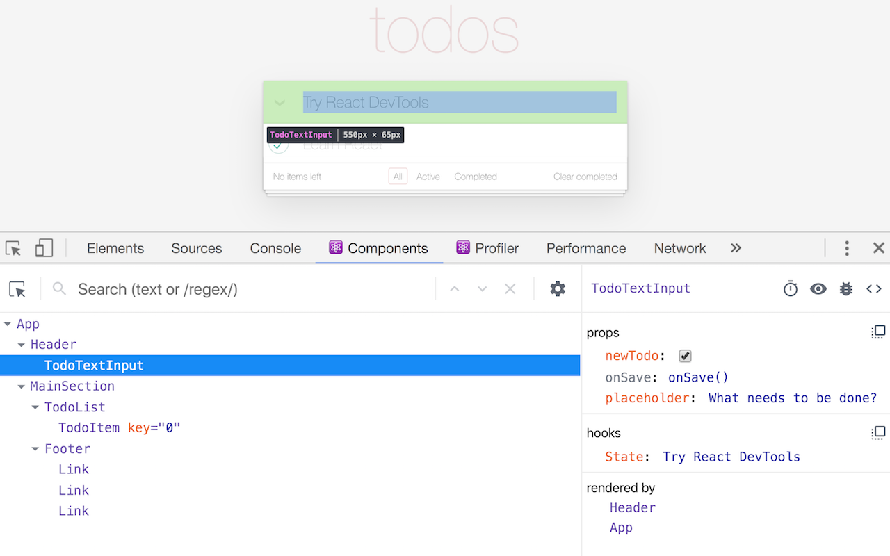

# My React Project :sparkles:

This React-based project showcases a range of components, unit testing, and efficient development practices.

## Resources :books:

- **React Components**: Fundamental building blocks of React applications, encapsulating logic and rendering behavior.

- **React Developer Tools**: A browser extension providing a React tree inspector, useful for examining the structure and state of React components.

- **Enzyme Shallow Rendering**: A testing technique in Enzyme that renders only the given component, not its children, ideal for isolated unit tests.

- **Enzyme Mount**: Full DOM rendering useful for testing interactions and lifecycle methods of components.

- **Enzyme Unmount**: A method to simulate the unmounting of a component, useful for testing cleanup behavior.

- **React Pure Components**: Components that shallowly compare props and state to optimize rendering, avoiding unnecessary updates.

- **React Higher Order Components (HOCs)**: Functions that take a component and return a new component, used for enhancing or modifying the behavior of the original component.

- **Jest Mock Functions**: Functions in Jest testing framework that allow you to spy on, stub, or mock functions, useful for isolating components in tests.

## Project Overview :mag:

This project demonstrates the use of modern React features and testing methodologies.

### Key Features

- Implementation of Pure React Components and HOCs.
- Comprehensive unit testing using Jest and Enzyme.

### Example Code

```jsx
import React from 'react';

class MyComponent extends React.Component {
  render() {
    return <div>Hello, React!</div>;
  }
}
```
## React Developer Tool
### Overview
Adds React debugging tools to the Chrome Developer Tools.

Created from revision 993c4d003 on 12/5/2023.

React Developer Tools is a Chrome DevTools extension for the open-source React JavaScript library. It allows you to inspect the React component hierarchies in the Chrome Developer Tools.

You will get two new tabs in your Chrome DevTools: "⚛️ Components" and "⚛️ Profiler".

The Components tab shows you the root React components that were rendered on the page, as well as the subcomponents that they ended up rendering.




## Running Tests :runner:
To run the tests, use the following command:
```
npm test
```

