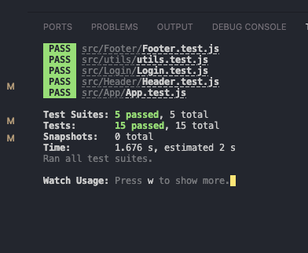

<p align="center">
  
</p>

# My React Project :sparkles:

## :bulb: Description
This project serves as a foundational step into the world of React, focusing on the creation, utilization, and best practices of React components.

## :bookmark_tabs: Resources
Here are some valuable resources that have been instrumental in this learning journey:

- [React Official Website](https://reactjs.org/)
- [Getting Started with React](https://reactjs.org/docs/getting-started.html)
- [React Overview](https://reactjs.org/docs/hello-world.html)
- [React Developer Tools](https://reactjs.org/blog/2015/09/02/new-react-developer-tools.html#installation)
- [Enzyme for Testing](https://enzymejs.github.io/enzyme/)
- [React Fragments](https://reactjs.org/docs/fragments.html)
- [Typechecking with PropTypes](https://reactjs.org/docs/typechecking-with-proptypes.html)

## :mortar_board: Learning Objectives
Through this project, I've gained knowledge and experience in various aspects of React:

### Creating Basic React Components Using Functions
- Learned the simplicity and power of function-based components.
- Explored how these components promote reusability and cleaner code.

### Reusing Components
- Delved into the React philosophy of "composition over inheritance".
- Practiced creating generic components that can be reused across the project.

### Passing Properties to Components
- Mastered the art of passing data to components via props.
- Understood the significance of props in building dynamic and interactive components.

### Defining Types for Components
- Implemented PropTypes to validate the types of props passed to components.
- This practice enhances the reliability and robustness of the application.

### Using Fragments
- Utilized Fragments to group a list of children without adding extra nodes to the DOM.
- This helps in keeping the DOM tree clean and improves performance.

### Using a Key to Improve a Loop’s Performance
- Learned the importance of using the `key` prop in loops to provide a unique identifier for React elements.
- This practice optimizes performance, especially in large lists and dynamic content.

## :computer: Code Example

```javascript
import React from 'react';
import PropTypes from 'prop-types';

const Greeting = ({ name }) => <h1>Hello, {name}!</h1>;

Greeting.propTypes = {
  name: PropTypes.string.isRequired,
};

export default Greeting;
 ```
## Desarrollo y Ejecución de Pruebas

Para desarrollar pruebas de manera eficiente y observar sus resultados en tiempo real, puedes configurar un script para ejecutar tu suite de pruebas automáticamente con cada cambio realizado:

1. **Configuración del Script de Observación:**
   Añade el siguiente script a tu `package.json` bajo la sección `scripts`:
   ```json
   "test-watch": "jest --watch"

### Ejecutar Suite de Pruebas:
Utiliza el siguiente comando para ejecutar tu suite de pruebas:
```bash
npm run test
```
  


## Pruebas Específicas

### `Header.test.js`:
- **Renderizado Superficial:** Asegura que el componente `Header` se renderiza sin problemas.
- **Verificación de Tags:** Confirma que el componente renderiza etiquetas `img` y `h1`.

### `Login.test.js`:
- **Renderizado Superficial:** Verifica que el componente `Login` se renderiza correctamente.
- **Verificación de Tags:** Comprueba que se renderizan 2 etiquetas `input` y 2 etiquetas `label`.

### `Footer.test.js`:
- **Renderizado Superficial:** Valida que el componente `Footer` se renderiza sin problemas.
- **Verificación de Contenido:** Asegura que, como mínimo, se renderiza el texto “Copyright”.

### `App.test.js`:
- **Contenido del Componente:** Verifica la presencia de los componentes `Notifications`, `Header`, `Login` y `Footer` dentro del componente principal `App`.


## :sunglasses: Author
Manuel Zambrano

- [my Github](https://github.com/mnlazs)

Crafting with :heart: and a bunch of :coffee:.


